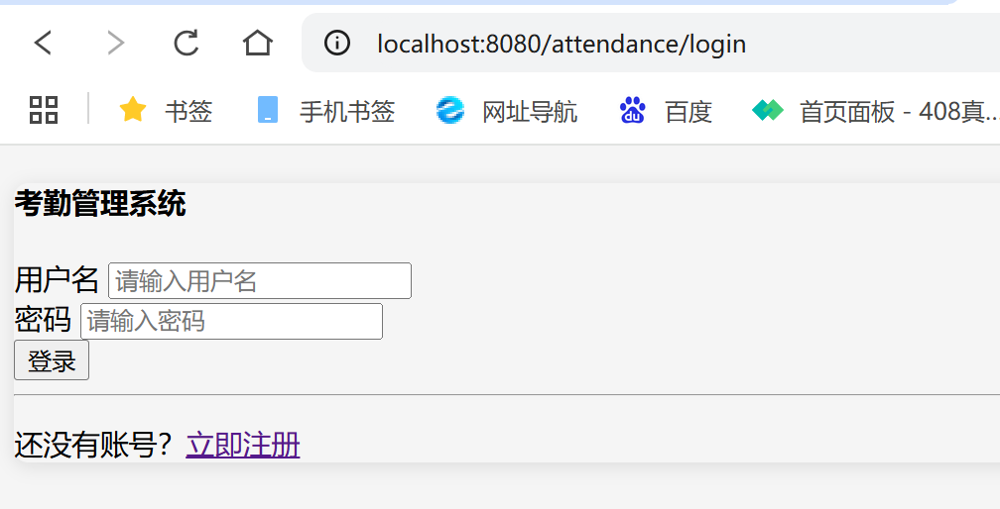
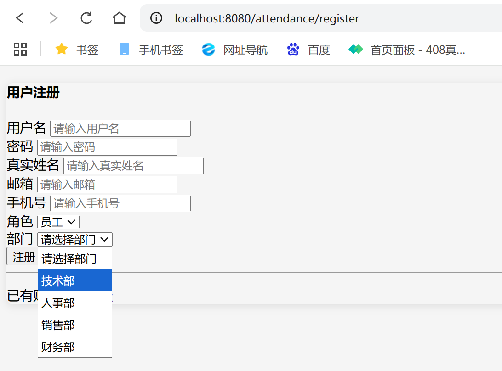
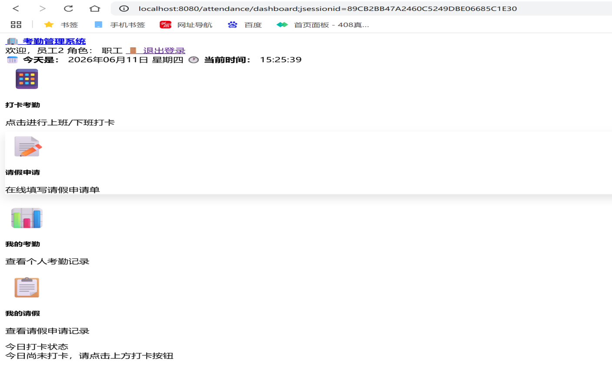
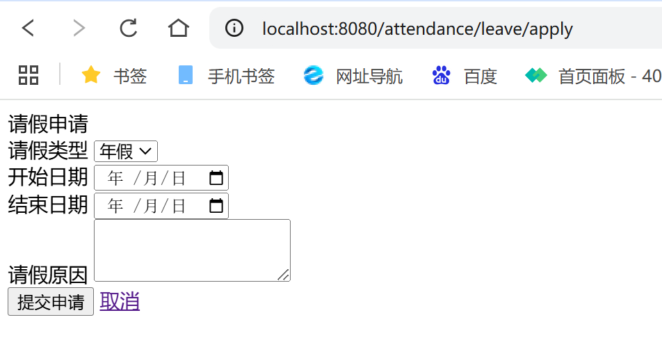
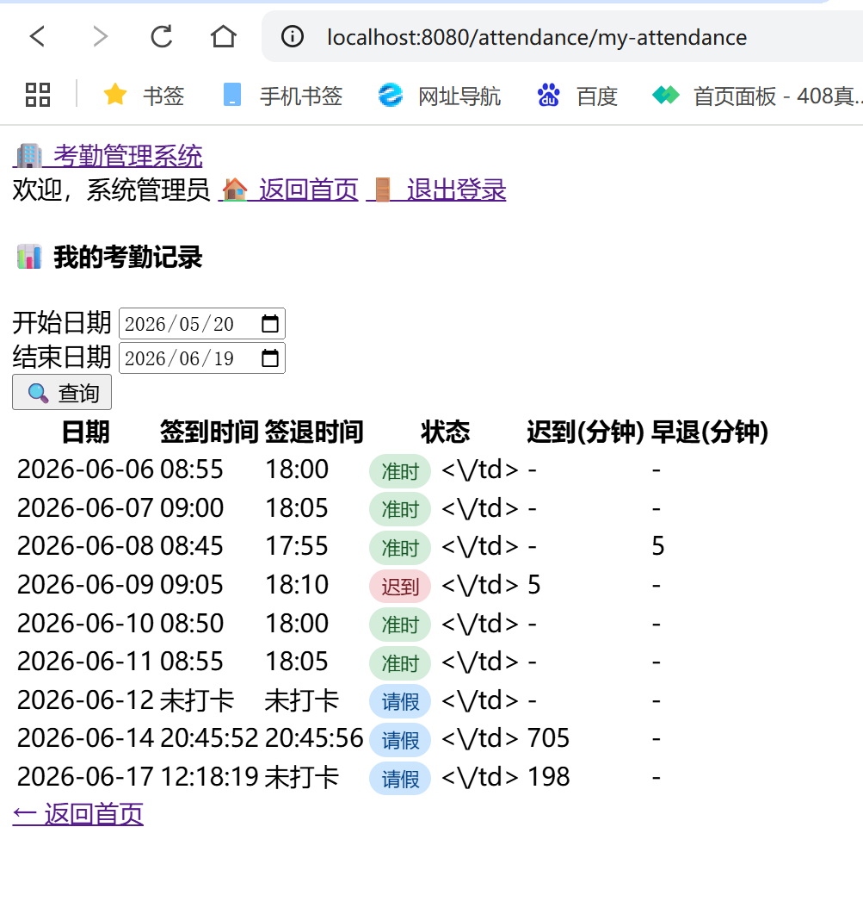
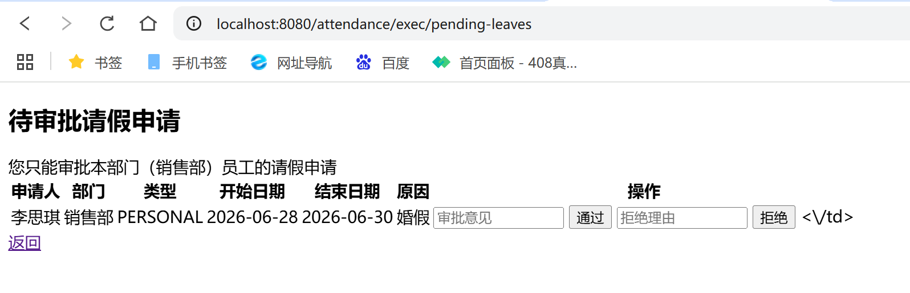

# attendance-management-system
基于 Spring Boot + MySQL 的考勤管理系统：职工/主管/管理员三角色权限、打卡自动判定迟到早退、在线请假审批
Java EE 课程设计 / 独立开发 / 2026.06

## 技术栈

**后端**：Java、Spring Boot
**数据库**：MySQL
**开发工具**：IntelliJ IDEA

## 核心功能

**三角色权限体系**：职工、部门主管、管理员；注册须管理员审核通过方可登录
**输入合法性校验**：注册与登录均做合法性验证，不符合要求给出提示
**打卡考勤**：按打卡时间与管理员设定的上下班时间，自动判定迟到 / 早退
**请假流程**：职工在线提交请假申请，部门主管在线审批
**考勤查询**：管理员可查看全员（包括部门主管）的考勤情况

## 运行方式
```bash
1. 克隆仓库
git clone https://github.com/sunxiaoshan206/attendance-management-system.git
cd attendance-management-system


3. 准备 MySQL，导入 src/main/resources 下的 SQL 文件
数据库名：attendance_db

4. 修改 src/main/resources/application.properties 中的数据库账号密码
spring.datasource.username=root
spring.datasource.password=123456

5. 启动
在 IDEA 中直接运行主启动类

6. 浏览器访问
http://localhost:8080

角色与默认账号

| 角色 | 账号 | 密码 | 权限 |
| 管理员 | admin | admin123 | 全员考勤查看、上下班时间设置、用户审核 |
| 部门主管 | exec1 | exec1| 部门考勤查看、请假审批 |
| 职工 | user1 | user1123 | 打卡、提交请假 |


## 项目截图
### 登录


### 注册


### 首页


### 打卡页


### 请假页


### 考勤页


### 审批页



## 目录结构
kaoqin/
├── src/
│   ├── main/
│   │   ├── java/com/attendance/
│   │   │   ├── controller/          # 控制层：处理页面和接口请求
│   │   │   ├── entity/              # 实体类：对应数据库表
│   │   │   ├── repository/          # 数据访问层：操作数据库
│   │   │   ├── service/             # 业务层：核心业务逻辑
│   │   │   └── KaoqinApplication.java  # 启动类
│   │   └── resources/
│   │       ├── static/              # 静态资源（css/js/图片）
│   │       ├── templates/           # 页面模板
│   │       └── application.properties  # 项目配置文件
│   └── test/                        # 测试代码
├── docs/
│   └── images/                      # 项目截图
├── .gitattributes
├── .gitignore
├── mvnw
├── mvnw.cmd
└── pom.xml                          # Maven 依赖配置

